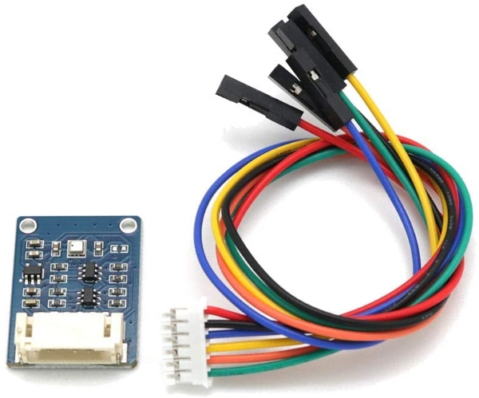
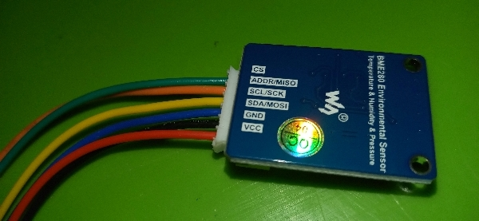
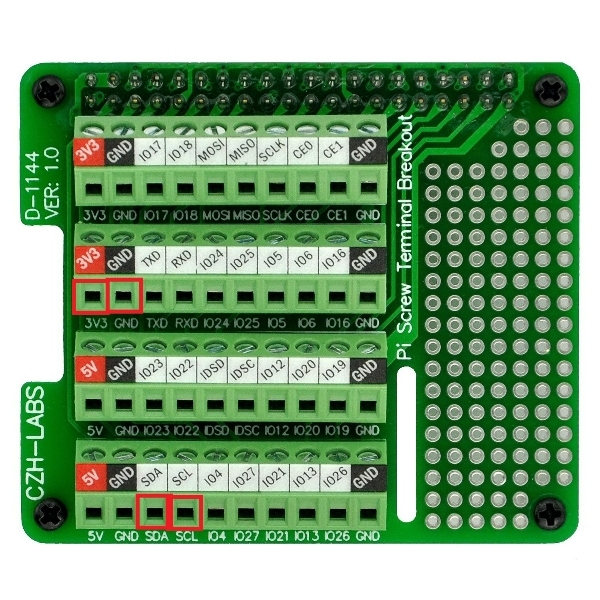

## Installing the BME280 Temperature, Pressure, and Humidity Module
1. Remove the **BME280** sensor from box.
  

  
2. Insert the cable into the sensor.
3. Locate the 4 wires marked: **VCC, GND, SCL/SCK,** and **SDA/MOSI.**
  

  
4. Strip the terminals off of these wires.
5. On the hat board locate terminals marked: **3v3, GND, SCL,** and **SDA.**
  

  
6. Unscrew the backs of these terminals.
7. Insert: **VCC** to **3v3**, **GND** to **GND**, **SCL/SCK** to **SCL** and **SDA/MOSI** to **SDA**.
8. Screw the backs of the terminals secure.