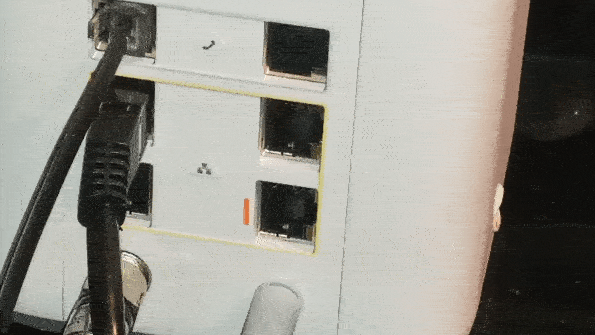

## Connecting Raspberry Pi to a Local Network via Ethernet
Ethernet is a technology that allows us to communicate directly with machines without Wi-Fi. In our case we must connect one end of the cable to a gateway and the other end of the cable to the  Raspberry Pi. The gateway allows the Raspberry Pi to access the internet, and allows us to communicate with it from anywhere outside our local network. Ethernet cables can be identified by their connectors.
1. Identify an ethernet cable.
2. Using an ethernet cable, plug one end into the gateway. 
  

  
3. Plug the other end into the Raspberry Pi.
  

  
4. Once a connection has been established, blinking lights will appear on the Pi.
5. From a windows or mac computer on the same network, open up a command prompt.
6. `ping raspberrypi.local` should return with information regarding this new device.