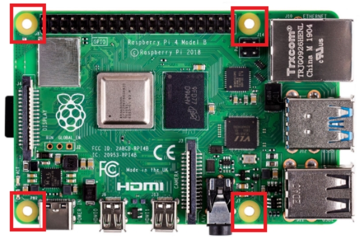
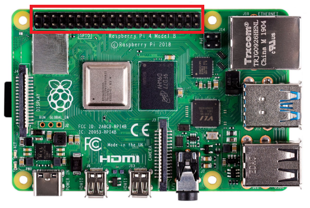
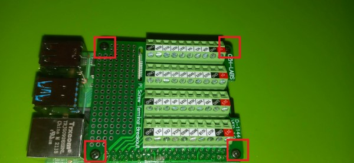

## Installing Raspberry Pi Hat Board
1. Carefully remove the Raspberry Pi Hat Board from the box.
**Note:** There are also several small screws and standoffs within this plastic bag.
2. Remove 4 standoffs and 4 screws from the plastic bag.
3. Locate the 4 mounting holes on the raspberry PI:
  

  
4. Place a standoff on the top side of the pi and insert a screw from the bottom side of the board.
  

  
5. Repeat for the three other corners and tighten until secure.
6. Locate the IO pins on the PI:
  

  
7. Carefully align the hat board with the pins and slide the two together.
  

  
8. Screw in the final 4 screws into the top of the hat board.
  

  