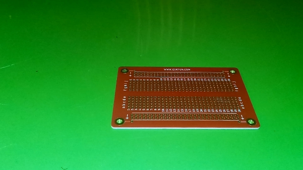
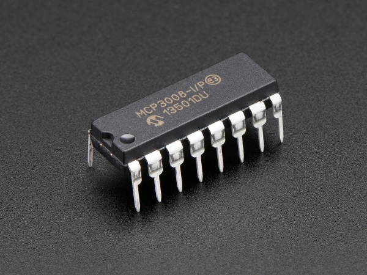
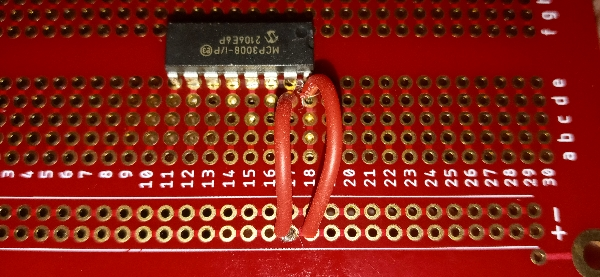
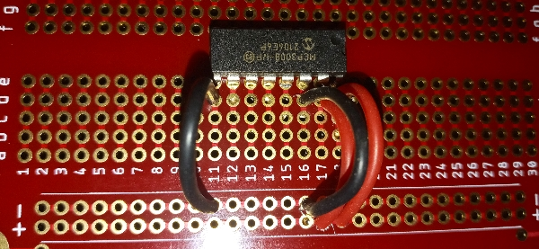
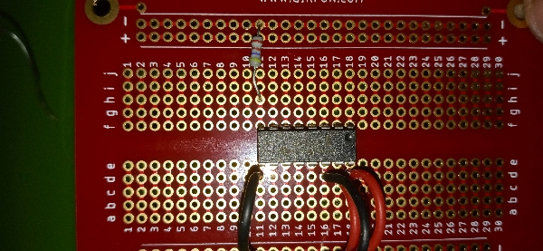
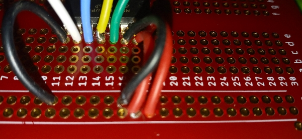
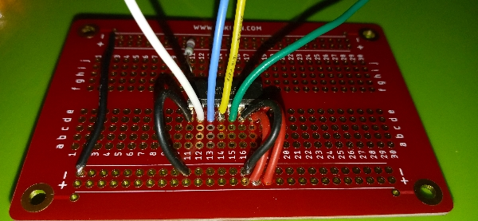
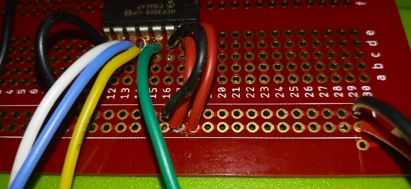
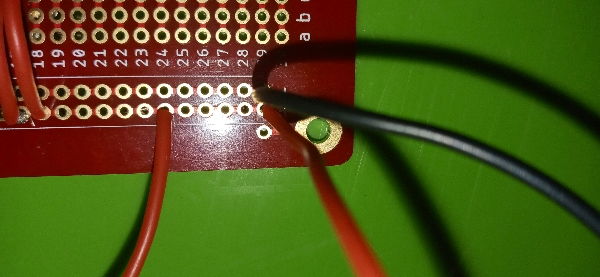
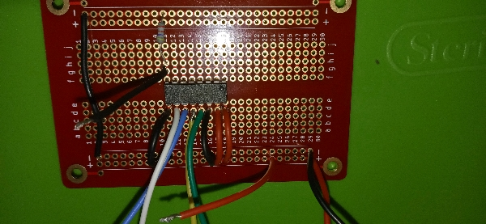

## Installing MCP3008 ADC to breadboard
1. FInd a clean breadboard
  

  
2. Find the MCP 3008 Integrated Circuit
  

  
3. Place the MCP3008 onto the breadboard on columns E and F with the top two pins inserted on row 18, and the bottom two pins inserted on row 11. The top of the circuit is indicated by the semi-circular notch. 
  

  
4. Flip the board over and solder the pins to the board.
  

  
5. Attach and solder 2 power wires. Attach one end of each wire to the positive rail, and the other ends to holes D17 and D18. 
  

  
6. Attach and solder 2 ground wires. Attach one end of each wire to the negative rail, and the other ends to holes D11 and D16.
  

  
7. Attach and solder the pull down resistor. Attach one end of the resistor to the negative rail, and the other end to hole H11.
  

  
8. Attach and solder 4 communication wires. Attach wires (at least 3.5 inches in length) to holes: D12, D13, D14, D15. Be sure to note the color and orientation of the wires for later connection to the Pi hat oard.
  

  
9. Attach and solder ground bridge. Attach a wire connecting the negative rails together.
  

  
10. Attach and solder power and ground input wires. On row 29 attach 2 wires (at least 3.5 inches in length) to holes on the positive and negative rails. Note the color of these wires for connection to the Pi hat board.
  

  
11. Attach and solder the wind direction voltage input wire. Attach a wire (at least 3.5 inches in length) to a hole on the positive rail.
  

  
12. Attach and solder the wind direction voltage output wire. Attach a wire (at least 1 inche in length) to hole G11.
  

  

