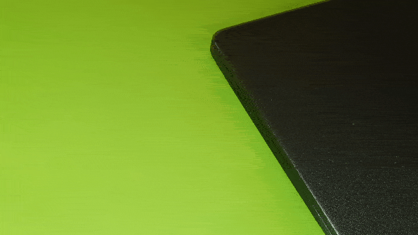

## Setting up Raspberry Pi Operating System
In order for us to get the Pi setup we need to first install the ***Operating System***.
An operating system is a special piece of software used by a computer to control the many tasks that it will need to handle. An operating system will also enable us to interact with the Pi and give it instructions.
To install the operating system, we need somewhere to put the special instructions that we need to give to the Pi for how to construct the operating system.
In our case we need a standard sized small storage device that is compatible with the Pi. 
A standard sized device already exists for smaller machines and we call it an ***SD Card***.
In the materials section of this guide is listed a specific type of SD card used for this project.
1. Take the SD card and insert it into a Windows or Mac computer.
  

  
2. From the official Raspberry Pi website download the quick start ***Raspbian for Robots*** OS installer.
  

  
3. Once downloaded, launch the application and install.
  

  
4. Select the operating system and SD card to install it on.
5. Close the launcher once the operating system has successfully been flashed to the SD.