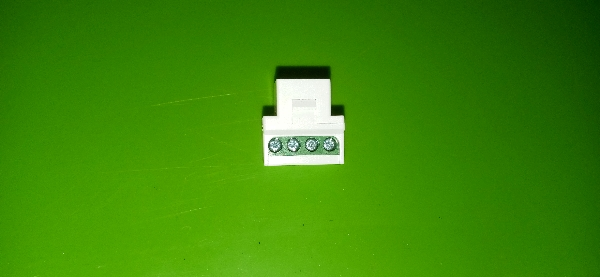
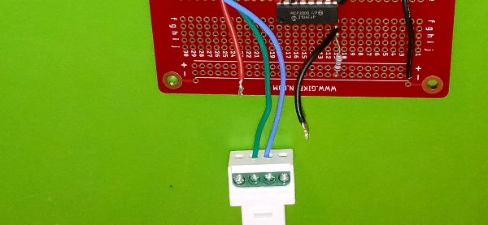
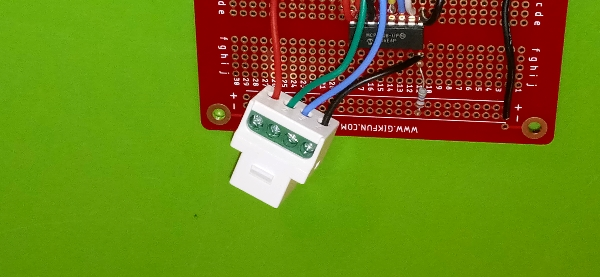
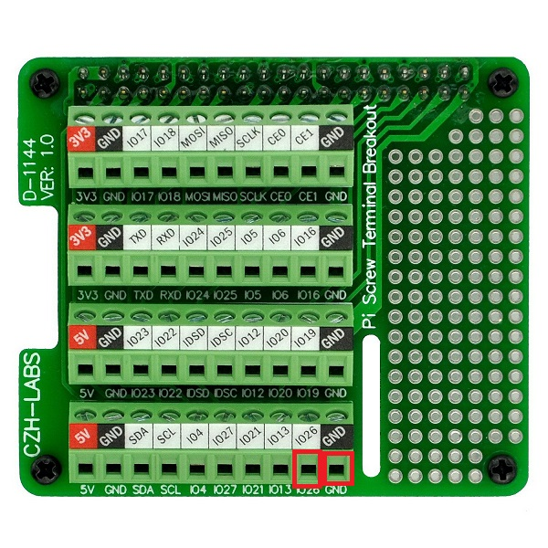
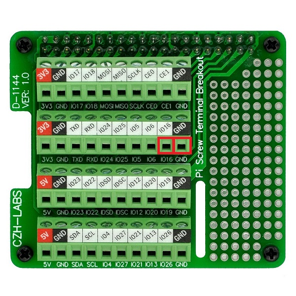

## Preparing RJ11 Connectors
 This is a RJ11 connectior. It is commonly used to transmit data from sensors such as our wind and rain sensors. We need to prepare two of these. One connector will be used for the rain sensor and the other will be used for the wind sensors. the rain sensor will require wires at least one inch in length and the wind sensor will require wires at least four inches in length.
  

  
1. Find two RJ11 connectors.
2. Unscrew the two middle terminals of the connectors.
  

  
3. Secure one wire into each terminal holes.
  

  
4. Screw the wires down and ensure the wires are firmly connected.
  

  
## Install RJ11 for Wind Speed and Direction
1. Place the RJ11 with the longer cables onto the MCP3008 bread board.
  

  
2. Install the sensor output wire, and the power wire into the outter two terminals connector (polarity does not matter).
  

  
3. Connect the 2 remaining inner wires (green and blue) to the hat board at IO26 and GND (polarity does not matter).
  

  
## Install RJ11 for Rainfall
1. Connect the 2 inner wires (green and blue) to the hat board at IO16 and GND (polarity does not matter).
  

  