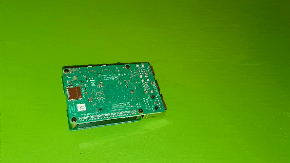
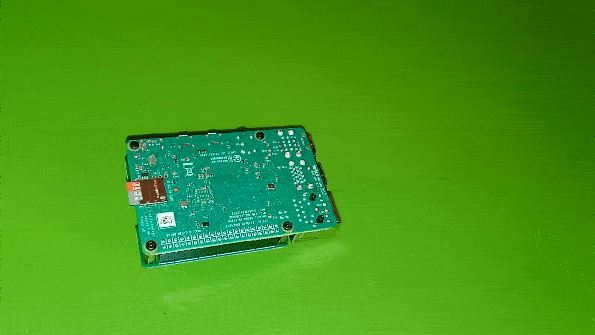

## Inserting and Removing SD Cards With Raspberry Pi
SD cards are small storage devices that can be used for small computer applications. We use an SD card as the primary storage on the Raspberry Pi.
- When inserting or removing an SD card great care must be taken as to not damage the board or card.
- When **inserting**, ensure that the one way pins are correctly aligned and gently press the card into the slot.
  

  
- When **removing**, grip the grooved end of the card and gently pull until the card is out.
  

  