## Setting up Wind and Rain Gauges
1. Remove all contents from the box.
2. Locate the two wind sensors and the t bracket.
  
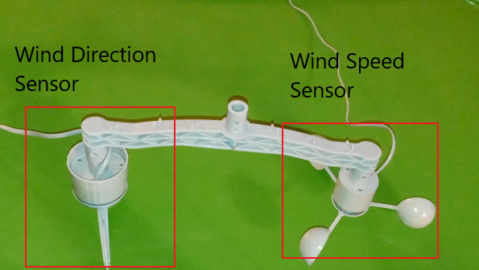
  
3. Insert each wind sensor into the side mounting points on the t bracket.
  
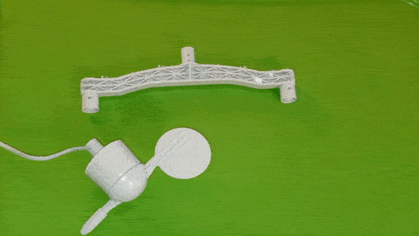
  
4. route the wire from the wind speed sensor to the other side of the t bracket through the guides.
  
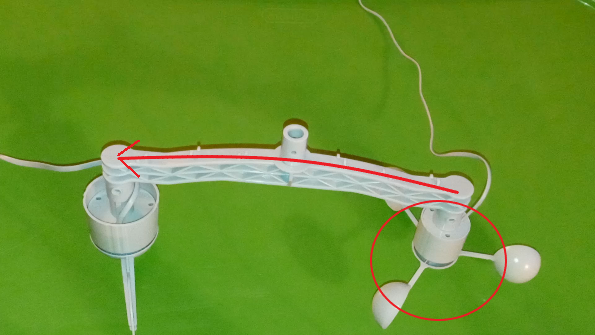
  
  

  
5. Connect the cable from the wind speed sensor to the bottom of the wind direction sensor.
  
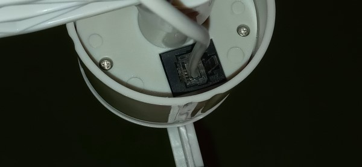
  
6. Place washers into the washer shaped holes on the sensors.
  
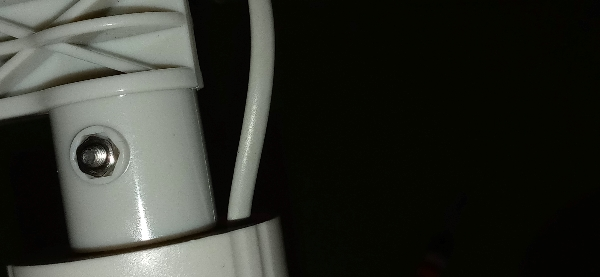
  
7. place screws into the opposite holes of the sensors, and screw the sensors onto the t bracket.
  
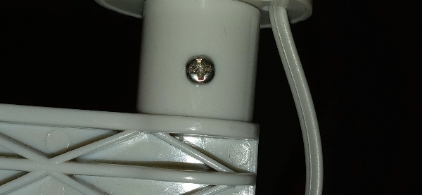
  
8. Insert the mounting pole with screw holes into the bottom of the t bracket.
9. Place a screw into the top hole on the mounting bracket and screw into place.
  
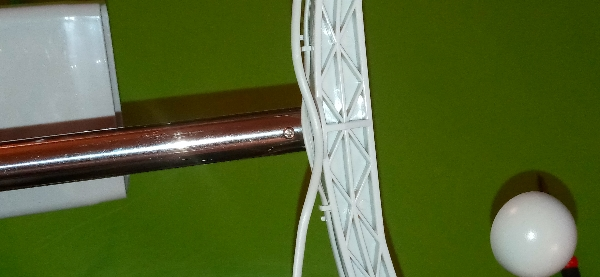
  
10. Identify the rain sensor and rain sensor mounting bracket pieces. Place a screw into the bracket hole.
  
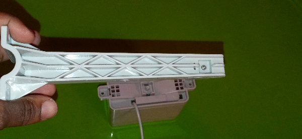
  
11. screw the rain sensor mounting bracket to the rain sensor.
  
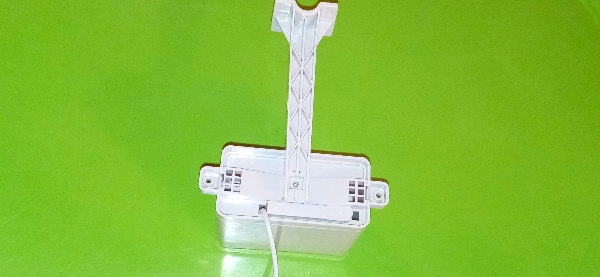
  
12. Insert the 4 screws on the rain sensor mounting bracket.
  
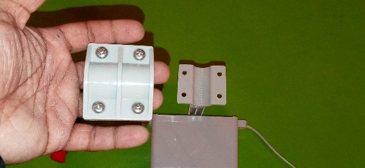
  
13. place the rain sensor mounting brackets around the mounting pole, place washers behind each screw, and tighten.
14. Finally, Insert the lower mounting pole into the upper mounting pole
  
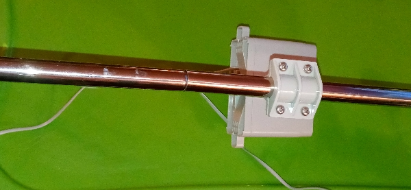
  

2. Ensure that the mechanical components are allowed to move freely and are in an area surrounded by at least 10 feet of open air.
3. Connect one RJ11 breakout terminal to the wind speed sensor Rj11 connector.
4. Connect one RJ11 breakout terminal to the rainfall sensor Rj11 connector.